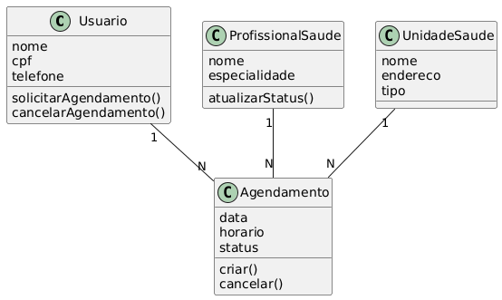

# PROJETO: SISTEMA DE AGENDAMENTO DE CONSULTAS MÉDICAS
## Objetivo do projeto:
Criação de um sistema que possibilita o agendamento em casa de um paciente para a Unidade Básica de Saúde ou Unidade Hospitalar mais próxima. Tendo como principal segmento para a eficácia a facilidade e a rapidez da possibilidade de agendamento sem necessitar de ir a unidade de saúde.
## Como ele irá funcionar na prática:
O projeto possibilitará ao usuário e possivelmente ao profissional dá saúde ter acesso a uma sequencia de funções desse sistema (conhecido como CRUD). Sendo para a aba de usuário viabilizando no pedido de um agendamento, visualização e o cancelamento do agendamento. Já para o profissional da saúde a possibilidade de gerir, definir estados do agendamento - podendo ser um dos exemplos de estado: a falta da presença do paciente.
O sistema deverá oferecer uma interface simples, amigável e acessível - já que projeto irá ter como alvo os públicos tanto jovens adultos quanto idosos. Afim de entregar uma experiencia transparente e objetiva para o usuário final.

## Diagrama UML:

## Principias Funcionalidaes
**1. Usuário**
* Criar agendamento
* Visualizar consultas marcadas
* Cancelar agendamento

**2. Profissional de Saúde**
* Visualizar agenda de atendimentos
* Atualizar status da consulta
* Registrar ausência de paciente

## Regras de Negócio
* Um paciente pode ter vários agendamentos.
* Cada agendamento pertence a apenas um paciente.
* O status do agendamento pode ser:
    * Solicitado
    * Confirmado
    * Cancelado
    * Concluído
    * Paciente ausente

## Tecnologias que serão utilizadas:
**1. Frontend:**
* HTML5
* CSS3
* JavaScript (Vanilla)

**2. Backend:**
* PHP (ou JavaScript (Node.js))

**3. Banco de Dados:**
* MySQL

## Licença: 
Projeto desenvolvido por loPs001, apenas para fins educacionais.

Obrigado pela atenção!

